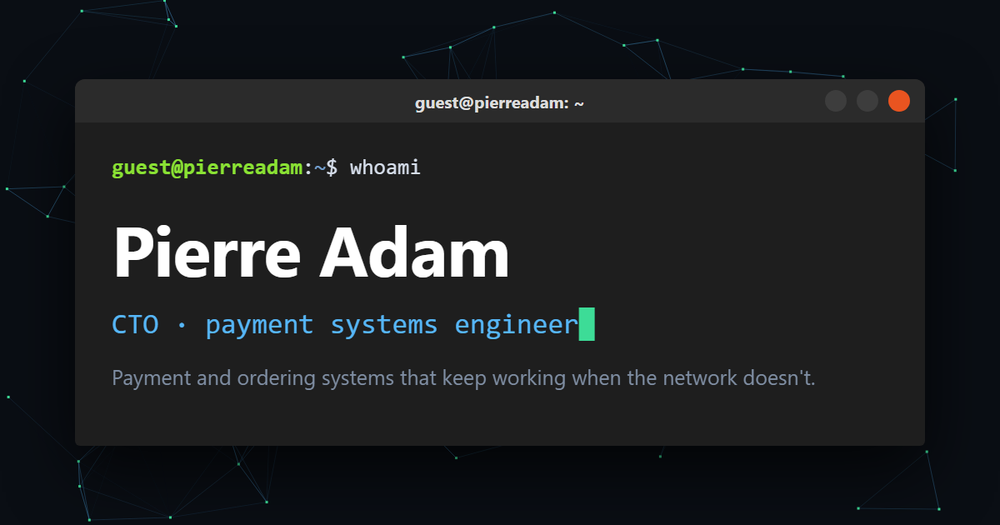

# www.pierre-adam.fr

My online CV, built as a fake Linux machine: it boots, opens a shell, runs `startx`, and then shows the site. Press <kbd>~</kbd> anywhere to open a terminal and poke around.

**Live:** [www.pierre-adam.fr](https://www.pierre-adam.fr) / [www.pierre-adam.eu](https://www.pierre-adam.eu)



## Features

- **Boot sequence** on the first visit: a systemd-style `[  OK  ]` log, a shell window with neofetch, `whoami`, `cat profile.json`, then `startx` into the site. Skippable, plays once per session.
- **English and French**, picked from the browser's language list, switchable from the menu or with `lang en|fr`.
- **Interactive terminal** (<kbd>~</kbd>, <kbd>`</kbd> or <kbd>²</kbd>) with tab completion and history:
  - `ls`, `cat about.txt` and friends: every section of the CV is a file
  - `neofetch`, `pay` (fake card terminal, try `pay --offline`), `matrix`, `hack`
  - `snake` and `tetris`, with best scores saved in the browser
  - Unix classics: `pwd`, `date`, `uname -a`, `echo`, `history`, `man`, plus a few hidden jokes
  - `restart` replays the whole boot sequence
- **Prints as a clean 2-page CV** with <kbd>Ctrl</kbd>+<kbd>P</kbd>: no animations, black on white, contact details in the header.
- **Phone-friendly** layout with a menu button.
- **Link previews** (Open Graph) for LinkedIn, Slack, WhatsApp and others.
- Respects `prefers-reduced-motion`.

No framework and no build step: plain HTML, CSS and JavaScript, served by nginx in a Docker container.

## Project layout

| File | What it does |
|---|---|
| `index.html` | Page structure and meta tags |
| `data.js` | **All the content**: CV text in both languages (`CV`) and interface strings (`UI`) |
| `main.js` | Rendering, language switch, boot intro, animations, terminal and its commands |
| `games.js` | Snake and Tetris |
| `style.css` | Screen, phone and print styles |
| `favicon.svg`, `favicon-180.png`, `og-image.png` | Icons and the link preview image |
| `assets-src/` | Source of the preview image and the script that renders it |
| `Dockerfile`, `nginx.conf` | Container image (nginx on port 80) |
| `docker-compose.yml` | Copy of the stack running on the server |
| `deploy.sh` | Build, push and deploy |

## Optional plug-ins

Extra console commands live in separate files that register themselves with `registerCommand()` (see `main.js`). Each one can be removed by deleting its file(s) and its `<script>` line at the bottom of `index.html`; nothing else depends on them.

| File(s) | Commands |
|---|---|
| `themes.js`, `themes/` | `theme amber`, `gameboy`, `c64`, `win95`, `theme off` |
| `modem.js` | `connect`: a 56k dial-up connection with a synthesized modem sound |
| `extras.js` | `cowsay`, `bsod`, `lynx` (and a hidden one) |

A single theme can be removed by deleting `themes/<name>.css` and its entry in `THEMES` in `themes.js`.

## Editing the content

Everything visible on the site lives in [`data.js`](data.js):

- `CV.common`: name, links, location, project list
- `CV.en` / `CV.fr`: pitch, about, experience, skills, project descriptions, education
- `UI.en` / `UI.fr`: menus, terminal messages, boot log, game labels

The terminal files (`experience.txt`, `skills.txt`...), neofetch and the print layout are generated from the same data, so they update by themselves.

## Running locally

Any static file server works:

```bash
python -m http.server 5500
```

Then open http://localhost:5500. To test the container instead:

```bash
docker build -t pierre-adam-website .
docker run --rm -p 8080:80 pierre-adam-website
```

## Deploying

```bash
./deploy.sh
```

It builds the image, tags it with the date and as `latest`, pushes it to my private registry, then pulls it and restarts the stack on the server over SSH. It needs Docker running locally, a `docker login` to the registry, and SSH access to the server.

On the server, the container listens on `127.0.0.1:10100` and the host nginx handles the domains and HTTPS (Let's Encrypt via Certbot).

## Regenerating the preview image

Edit [`assets-src/og.html`](assets-src/og.html), then:

```bash
./assets-src/build-og.sh
```

It renders `og-image.png` (1200×630) and `favicon-180.png` with headless Microsoft Edge (Windows, Git Bash).
